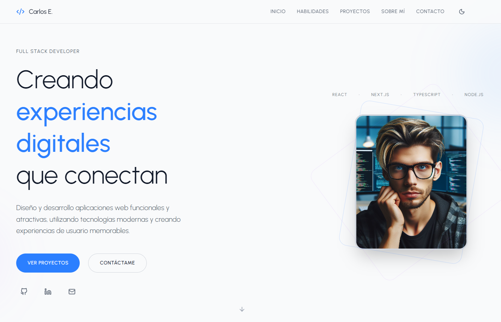

# 💼 CESB Dev Portfolio 💻

[](https://cesb-dev-portfolio.app/)

Te doy la bienvenida a **CESB Dev Portfolio**, un espacio donde comparto proyectos creados con dedicación y pasión por la tecnología y el diseño, este portafolio pone en evidencia mis habilidades en **desarrollo frontend y full stack**, combinando interfaces modernas con código limpio y eficiente, cada sección está pensada para ofrecer una experiencia de navegación fluida y destacar el valor de cada proyecto, desde **landing pages interactivas** hasta **aplicaciones web completas**.

---

## 🌟 Características Principales

- 🎯 **Proyectos destacados con navegación clara** y enfoque profesional.
- 📱 **Diseño responsive** adaptado a todo tipo de dispositivos.
- ✨ **Animaciones fluidas** mediante Framer Motion.
- 🎨 **UI moderna y consistente** con Tailwind CSS.
- 🌙☀️ **Modo claro y oscuro** para una experiencia adaptable a cualquier preferencia.
- 🚀 **Optimización de rendimiento** y velocidad gracias a Vite y buenas prácticas.
- 🗂️ **Categorías de proyectos** para explorar fácilmente según tu interés.

---

## 📌 Proyectos Destacados

| Proyecto | Descripción | Tecnologías | Enlace |
|----------|-------------|-------------|-------|
| **EShop CESB** | Tienda online de productos tecnológicos con navegación fluida y diseño atractivo. | React, Tailwind CSS, JavaScript, HTML, CSS | [Ver proyecto](https://eshop-cesb.netlify.app/) |
| **Event Horizont** | Plataforma para descubrir eventos y experiencias culturales. | React, Tailwind CSS, JavaScript, HTML, CSS | [Ver proyecto](https://event-horizont.netlify.app/) |
| **Shop Cart** | Página de ventas de productos deportivos y para el hogar con interfaz intuitiva. | React, Bootstrap, Sass, JavaScript, HTML, CSS | [Repositorio](https://github.com/carlossilvadev10/shop-cart) |
| **Nike Store** | Tienda virtual inspirada en Nike, enfocada en experiencia de usuario optimizada. | React, Tailwind CSS, JavaScript, HTML, CSS | [Ver proyecto](https://nike-store-sport.vercel.app/) |

---

## 🛠️ Tecnologías Utilizadas 👨‍💻

| HTML | CSS | JavaScript | React | Tailwind CSS | Vite | Node.js | ESLint |
|------|-----|------------|-------|--------------|------|---------|--------|
|  |  |  |  |  |  |  |  |

---

## 🚀 Instalación y Uso Local

Sigue estos pasos para clonar y ejecutar el proyecto en tu máquina local:

1. **Clona el repositorio:**

   ```bash
   git clone https://github.com/carlossilvadev10/portfolio-cesb.git
   ```

2. **Entra en el directorio del proyecto:**

   ```bash
   cd portfolio-cesb
   ```

3. **Instala las dependencias necesarias:**

   ```bash
   npm install
   ```

4. **Ejecuta la aplicación en entorno de desarrollo:**

   ```bash
   npm run dev
   ```

5. **Abre tu navegador y visita:**

   ```bash
   http://localhost:3000
   ```

---

## 📩 Contacto

Si tienes alguna pregunta o sugerencia, puedes encontrarme en:

- 🌐 [Mi GitHub](https://github.com/carlossilvadev10)
- 📧 Email: [carlos.esilva1007@gmail.com](mailto:carlos.esilva1007@gmail.com)
- 💼 [Mi LinkedIn](https://www.linkedin.com/in/carlos-eduardo-silva-bustamante-b6084528b?utm_source=share&utm_campaign=share_via&utm_content=profile&utm_medium=android_app)

---

✨ Gracias por visitar **CESB Dev Portfolio**. Cada proyecto aquí refleja mi **dedicación al desarrollo y al diseño**, y el próximo proyecto podría ser el tuyo.